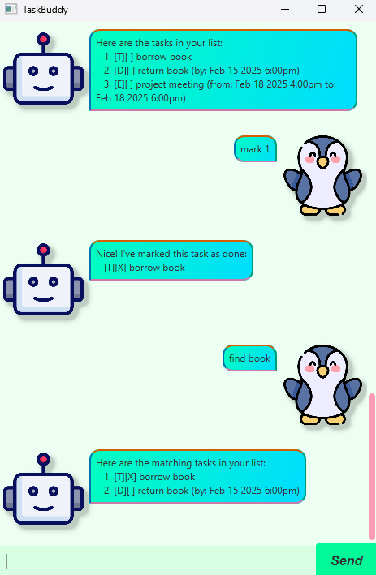

# TaskBuddy User Guide 🤖



## Introduction
Say _hello_ to TaskBuddy, your cheerful and friendly task management chatbot! 🌟 Whether you're tackling a mountain of tasks or just need a little help staying on top of things, TaskBuddy is here to keep you organized and smiling. Need to add a task? TaskBuddy is on it! ✅ Want to delete one that’s already done? No problem! 🗑️ You can even mark tasks as completed with a celebratory high-five or unmark them when life throws a curveball. 💫

Looking for a specific task or curious about your upcoming plans? Just ask, and TaskBuddy will pull up your schedule like a trusty sidekick. Think of TaskBuddy as your adorable little assistant, always ready to help you stay on track with a smile and a wink. ✨ Ready to make task management a little more fun? TaskBuddy’s got your back!

## Features
- [Add todo task `todo`](#todo)
- [Add deadline task `deadline`](#deadline)
- [Add event task `event`](#event)
- [List all tasks `list`](#list)
- [Mark a task as completed `mark`](#mark)
- [Unmark a task as incomplete `unmark`](#unmark)
- [Delete a task `delete`](#delete)
- [Find a task `find`](#find)
- [View a specific date `view`](#view)
- [Exit the chatbot `bye`](#bye)

<a id="todo"></a>
## Add a todo task: `todo`
Adding a todo task to the task list.

Format: `todo [task description]`

Example: `todo borrow book`

Expected output:
```
Got it. I've added this task:
  [T][] borrow book
```

<a id="deadline"></a>
## Add a deadline task: `deadline`
Adding a deadline task to the task list.

Format: `deadline [task description] /by [date] [time]`

Example: `deadline return book /by 2025-02-15 1800`

Expected output:
```
Got it. I've added this task:
  [D][] return book (by: Feb 15 2025 6:00pm)
```

<a id="event"></a>
## Add an event task: `event`
Adding an event task to the task list.

Format: `event [task description] /from [date] [time] /to [date] [time]`

Example: `event project meeting /from 2025-02-18 1600 /to 2025-02-18 1800`

Expected output:
```
Got it. I've added this task:
  [E][] project meeting (from: Feb 18 2025 4:00pm to: Feb 18 2025 6:00pm)
```

<a id="list"></a>
## List all tasks: `list`
Listing all tasks of task list.

Format: `list`

Expected output:

```
Here are the tasks in your list:
  1. [T][] borrow book
  2. [D][] return book (by: Feb 15 2025 6:00pm)
  3. [E][] project meeting (from: Feb 18 2025 4:00pm to: Feb 18 2025 6:00pm)
```

<a id="mark"></a>
## Mark a task: `mark`
Marking a completed task.

Format: `mark [task number]`

Example: `mark 1`

Expected output:
```
Nice! I've marked this task as done:
  [T][X] borrow book
```

<a id="unmark"></a>
## Unmark a task: `unmark`
Unmarking an incomplete task.

Format: `unmark [task number]`

Example: `unmark 1`

Expected output:
```
OK, I've marked this task as not done yet:
  [T][] borrow book
```

<a id="delete"></a>
## Delete a task: `delete`
Deleting a task.

Format: `delete [task number]`

Example: `delete 1`

Expected output:
```
Noted. I've removed this task:
  [T][] borrow book
```

<a id="find"></a>
## Find a task: `find`
Finding a task using specific keywords.

Format: `find [keyword]`

Example: `find book`

Expected output:

```
Here are the matching tasks in your list:
  1. [D][] return book (by: Feb 15 2025 6:00pm)
```

<a id="view"></a>
## View a specific date: `view`
Viewing tasks for a specific date.

Format: `view [date]`

Example: `view 2025-02-15`

Expected output:
```
Here are the tasks for this date:
  1. [D][] return book (by: Feb 15 2025 6:00pm)
```

<a id="bye"></a>
## Exit the chatbot: `bye`
Exiting the chatbot.

Format: `bye`

Expected output:
```
Bye. Hope to see you again soon!
```
